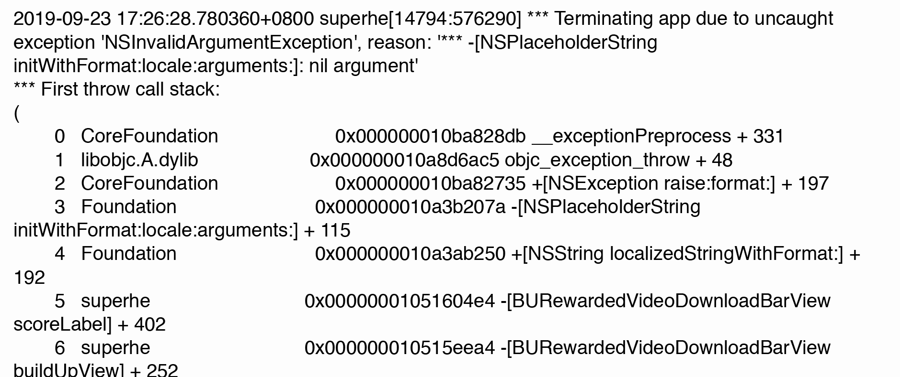
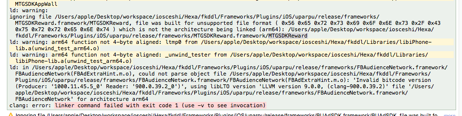

# **FAQ**

## 简介
本文档介绍在集成BiLuSDK发生的一些问题并提供解决方案

- **Q：SDK接入时出现崩溃：原因之Build路径放置错误**

- A：遇到此情况，请确认应用导入的SDK库Build资源的路径是否正确。

- **Q：SDK接入时出现崩溃：原因之使用其他第三方导致崩溃：**
[AppController window]: unrecognized selector 
在项目里使用了SVProgressHUD，结果在调用的时候就闪退了 崩溃信息如下： 
Terminating app due to uncaught exception ‘NSInvalidArgumentException’, reason: ‘-[AppController window]: unrecognized selector sent to instance 0x7faa22d1aad0’
(2)捕捉到异常-[AppController window]: unrecognized selector sent to instance 0x2b55790

- A：*原因：未提供window实例变量的getter方法。 
*解决办法：在Appcontroller.mm文件中，在@implementation Appcontroller下增加代码@synthesize window = window；即可。

- **Q：SDK接入时出现Linker command failed：原因之Xcode版本太低：**

- A：SDK基础配置:Xcode10版本及以上 Target iOS 9.0及以上。

- **Q：Banner广告为什么显示不全：**

- A：Banner不一定能显示得全，因为它本身有尺寸的，但是会居中。
