# **iOS集成BiLuSDK**

## 1 简介
本文档介绍如何去集成iOS端的BiLuSDK（后面简称为SDK），包括获取开发者账号，获取AppID和AppKey并创建配置进行广告投放。
### 1.1 支持的广告类型
BiLuSDK支持激励视频广告(rewardVideo)，banner广告和插屏广告(intersitial)。
### 1.2 支持的分享类型
BiLuSDK支持微信好友和微信朋友圈分享，QQ好友和QQ空间分享。


## <h2 id='1'>2 配置</h2>
### 2.1 基础配置
	Xcode10版本及以上。
	Target iOS 9.0及以上。

### 2.2 导入基础核心框架
核心模块包含以下框架和资源包文件，只需将它们拖放到Xcode中。

- BiLuSDK.framework


**注:** 由于**BiLuSDK**暂时不支持cocoapod

### 2.3 导入BiLuSDK和第三方的支持SDK


|第三方平台|需要导入的包|**BiLu**支持的版本|参考网址|备注|    
|---|---|---|---|---|   
|Admob|GoogleMobileAds.framework<br>GoogleAppMeasurement.framework<br>GoogleUtilities.framework<br>nanopb.framework|v7.48.0|https://developers.google.com/admob/ios/quick-start|需要在info.plist配置GADApplicationIdentifier|
|TouTiao|BUAdSDK.framework<br>BUAdSDK.bundle|v2.3.1.0|http://ad.toutiao.com/union/media/union/download||
|UpArpuSDK|UpArpuAdmobInterstitialAdapter.framework<br>UpArpuTTRewardedVideoAdapter.framework<br>UpArpuBanner.framework<br>UpArpuInterstitial.framework<br>UpArpuRewardedVideo.framework<br>UpArpuSDK.framework<br>UpArpuTTInterstitialAdapter.framework<br>UpArpuAdmobRewardedVideoAdapter.framework<br>UpArpuAdmobBannerAdapter.framework<br>UpArpuTTBannerAdapter.framework|v2.3.1.0|https://github.com/uparputeam/uparpu_demo_ios/blob/master/iOS_Doc_CHN/iOS_Integration_Guide.md||
|ShareSDK|ShareSDKConnector.framework<br>ShareSDK.bundle<br>MOBFoundation.framework<br>ShareSDK.framework<br>ShareSDKUI.bundle<br>ShareSDKExtension.framework<br>MobLinkPro.framework<br>ShareSDKUI.framework<br>QQConnector.framework<br>WechatConnector.framework|v2.3.1.0|https://www.mob.com/wiki/detailed?wiki=ShareSDK_ios_fast_integration_fast&id=14||


**注:** 导入SDK和系统支持库操作

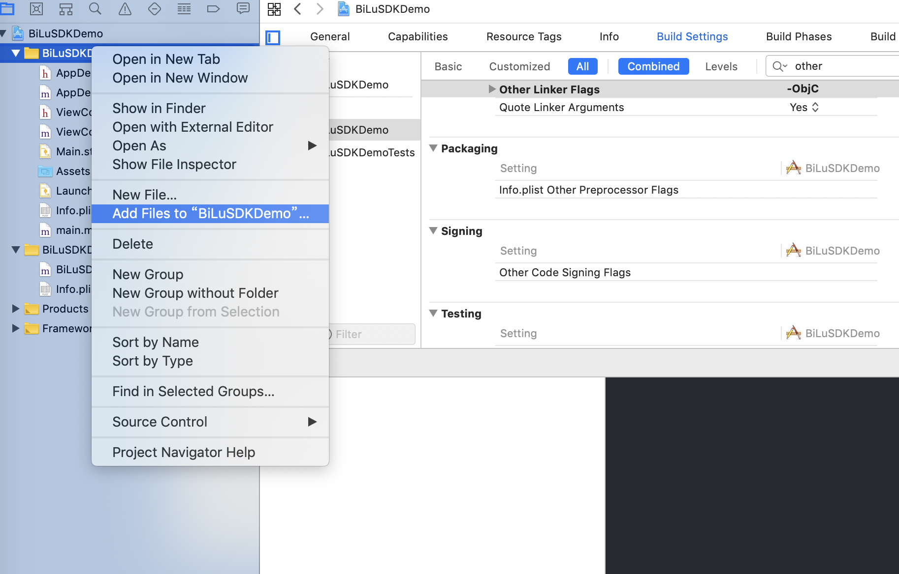
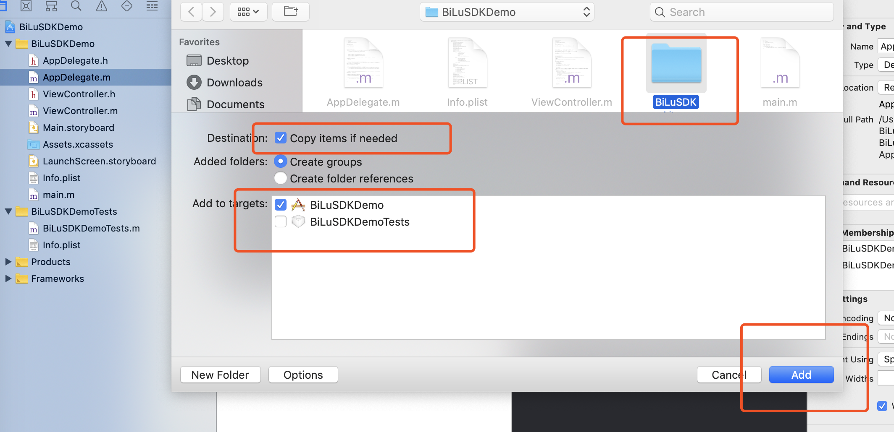
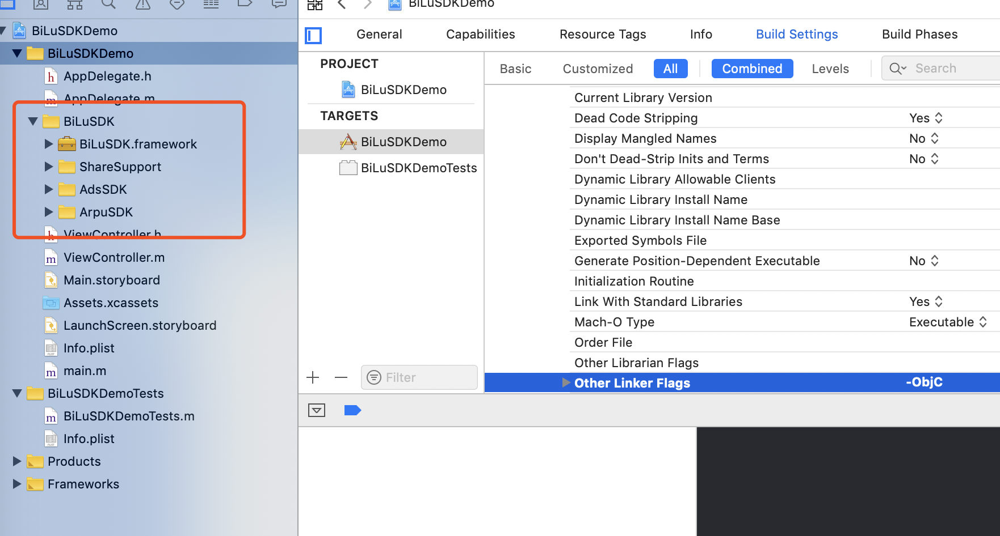
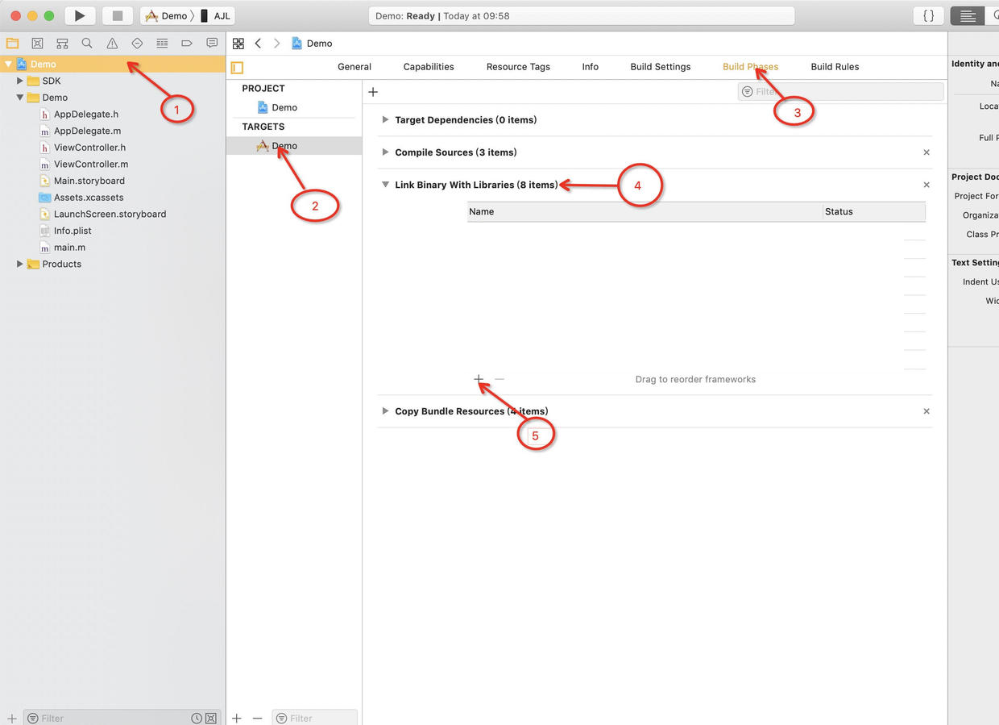

- StoreKit.framework
- MobileCoreServices.framework
- WebKit.framework
- MediaPlayer.framework
- CoreMedia.framework
- AVFoundation.framework
- CoreTelephony.framework
- SystemConfiguration.framework
- AdSupport.framework
- CoreMotion.framework
- CoreLocation.framework  
- QuartzCore.framework
- libxml2.tbd
- libresolv.9.tbd
- libsqlite3.tbd
- libc++.tbd
- libz.tbd


### 2.4 配置 Build Settings 和 Info.plist

1) 在 Xcode中, 点击到 **Build Settings**, 搜索 **Other Linker Flags** 然后添加 **-ObjC**(这里的字母O和字母C**需要大写**), 注意 **Linker Flags** 是区分大小写的:
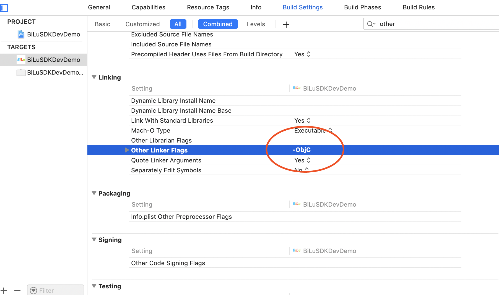

2) 在 Xcode中, 点击到 **Build Settings**, 搜索 **Enable Bitcode** 设置为NO
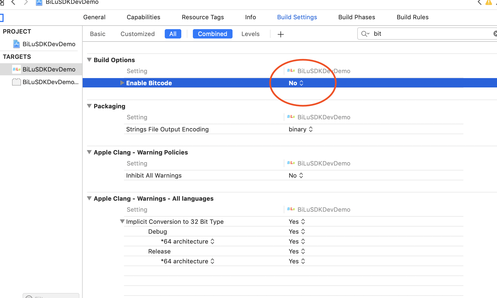

3) 在您app的Info.plist中添加 **App Transport Security Settings** - **NSAllowsArbitraryLoads** 设置为YES


4) 在您app的Info.plist中添加 **GADApplicationIdentifier** 对应的值是Admob的应用ID
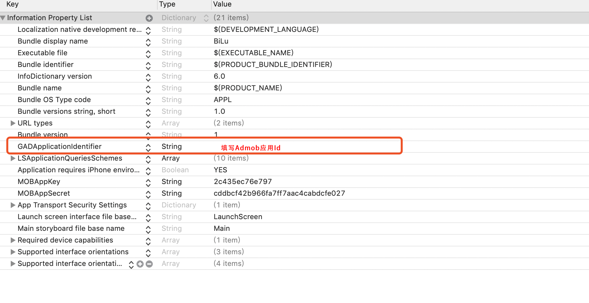

5) 在您app的Info.plist中添加 **MOBAppKey**和 **MOBAppSecret** 对应的值是Share的Appkey和AppSecret
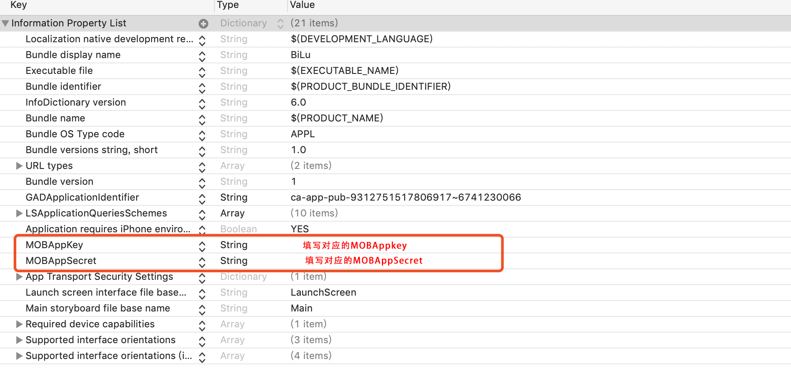

6) 在您app的Info.plist中添加 **LSApplicationQueriesSchemes** 添加以下值
- wechat
- weixin
- mqqOpensdkSSoLogin
- mqqopensdkapiV2
- mqqopensdkapiV3
- wtloginmqq2
- mqq
- timapi
- mqqapi
- mqqopensdkminiapp


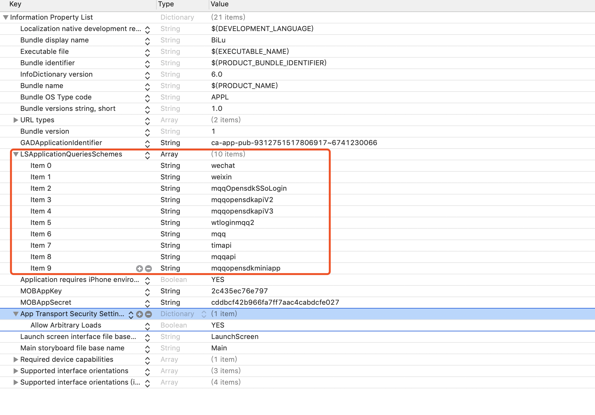

7) iOS 12.0 及以上系统获取 WiFi 的信息时，需要打开 **Access WiFi Information** 选项（Xcode 10.0 以上有此选项）
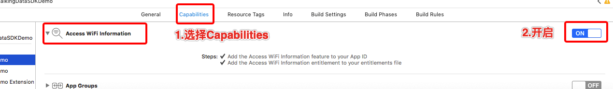

8) 设置权限
- Privacy - Location When In Use Usage Description
- Privacy - Location Always and When In Use Usage Description
- Privacy - Location Always Usage Description
- Privacy - Location Usage Description

### 2.5 初始化SDK

您需要在**AppDelegate**的**application:didFinishLaunchingWithOptions:**方法里面初始化**BiLuSDK**(必须在请求广告之前去初始化SDK)：

<pre><code>
- (BOOL)application:(UIApplication *)application didFinishLaunchingWithOptions:(NSDictionary *)launchOptions {
	
    BiLuConfiguration *configuration = [BiLuConfiguration configuration];
    configuration.WXAppID = @"微信appId";
    configuration.WXAppKey = @"微信appkey";
    configuration.QQAppID = @"QQappId";
    configuration.QQAppKey = @"QQappkey";
    configuration.sdkType = @"Unity";
    [BiLuSDKManager registerWithAppID:@"哔噜AppId" appKey:@"哔噜AppKey" configuration:configuration];

    return YES;
}</code></pre>

## 3 分享
在继续接入之前，您需要保证您已经完成了以上 [配置](#1) 步骤。
### 3.1 配置分享
在 Xcode 中，选择你的工程设置项，选中“TARGETS”一栏，在“info”标签栏的“URL type“添加“URL scheme”为你所注册的应用程序 id（如下图所示）。

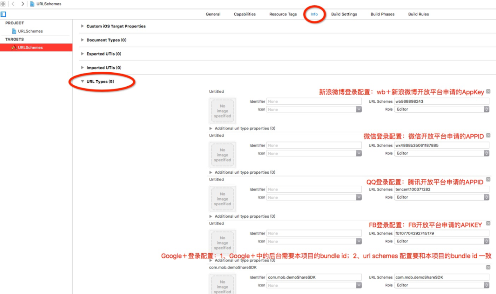

### 3.1 带UI的分享

<pre><code>
[BiLuShare shareWithUIRespBlock:^(NSError *error, BiLuShareResponse state) {

}];
</code></pre>

### 3.2 自定义UI分享

<pre><code>
[BiLuShare shareWithScene:BiLuShareSenceWXSession respBlock:^(NSError *error, BiLuShareResponse start) {
            
}];
</code></pre>

## 4 激励视频(Rewarded Video)
在继续接入之前，您需要保证您已经完成了以上 [配置](#1) 步骤。

### 4.1 加载Rewarded Video
您需要确认您添加了**BiluAdLoadingDelegate**和**BiLuAdsRewardedVideoDelegate**代理协议：
```
@interface ViewController() <BiluAdLoadingDelegate,BiLuAdsRewardedVideoDelegate>

@end
```
加载Rewarded Video广告:
<pre><code>
/**
 广告加载信息

 @param placementId 广告位Id
 @param extra 附加信息
 @param type 广告类型 BiLuAdsTypeRewardedVideo
 @param delegate 回调代理
 */
 [[BiLuAdsManager sharedInstance] loadADWithPlacementId:@"广告位Id" extra:@{kUPArpuAdLoadingExtraUserIDKey:@"test\_user\_id"} type:BiLuAdsTypeRewardedVideo delegate:self];
</code></pre>

您可以实现以下的代理方法来获取各种加载事件：
<pre><code>
#pragma mark - BiluAdLoadingDelegate
/**
 广告加载完成

 @param placementId 广告位Id
 */
- (void)didFinishLoadingADWithPlacementId:(NSString *)placementId{

    NSLog(@"广告加载成功 PlacementId：%@ ",placementId);
}
/**
 广告加载失败

 @param placementId 广告位Id
 @param error 错误信息
 */
- (void)didFailToLoadADWithPlacementId:(NSString*)placementId error:(NSError*)error{
    
    NSLog(@"广告加载失败 PlacementId：%@ error:%@",placementId,error);
}
</code></pre>

### 4.2 判断Rewarded Video是否ready
您可以检查Rewarded Video广告是否已经Ready
<pre><code>
if ([[BiLuAdsManager sharedInstance] rewardedVideoReadyForPlacementId:@"广告位Id"]) {
    [[BiLuAdsManager sharedInstance] showRewardedVideoWithPlacementId:@"广告位Id" inViewController:self delegate:self];

}else{
    NSLog(@"激励视频广告还没准备好");
}
</code></pre>

### 4.3 展示Rewarded Video
在您Rewared Video加载完成之后，您可以用BiLuAdsManager去展示Rewared Video：
<pre><code>
[[BiLuAdsManager sharedInstance] showRewardedVideoWithPlacementId:@"广告位Id" inViewController:self delegate:self];
</code></pre>

### 4.4 实现Rewarded Video的Delegate
您可以实现**BiLuAdsRewardedVideoDelegate**的方法来获取Rewarded Video的各种事件：

<pre><code>
#pragma mark - BiluAdRewardedVideoDelegate
/**
 激励视频广告播放成功

 @param placementId 广告位Id
 @param extra 附加信息
 */
- (void)rewardedVideoDidStartPlayingForPlacementId:(NSString *)placementId extra:(NSDictionary *)extra{

    NSLog(@"播放激励视频广告成功\nPlacementId：%@ extra：%@",placementId,extra);
}
/**
 激励视频广告播放失败
 
 @param placementId 广告位Id
 @param error 错误信息
 @param extra 附加信息
 */
 - (void)rewardedVideoDidFailToPlayForPlacementId:(NSString *)placementId error:(NSError *)error extra:(NSDictionary *)extra{

    NSLog(@"播放激励视频广告失败\nPlacementId:%@\nerror:%@\nextra:%@",placementId,error,extra);
}

/**
 激励视频广告播放结束

 @param placementId 广告位Id
 @param extra 附加信息
 */
- (void)rewardedVideoDidEndPlayingForPlacementId:(NSString *)placementId extra:(NSDictionary *)extra{

    NSLog(@"rewardedVideoDidEndPlayingForPlacementId：%@ extra：%@",placementId,extra);
}
/**
 激励视频广告点击事件
 
 @param placementId 广告位Id
 @param extra 附加信息
 */
- (void)rewardedVideoDidClickForPlacementId:(NSString *)placementId extra:(NSDictionary *)extra{
    
    NSLog(@"rewardedVideoDidClickForPlacementId：%@ extra：%@",placementId,extra);
}
/**
 激励视频广告关闭事件

 @param placementId 广告位Id
 @param rewarded 是否观看完广告获得奖励 YES 是 NO 不是
 @param extra 附加信息
 */
 - (void)rewardedVideoDidCloseForPlacementId:(NSString *)placementId rewarded:(BOOL)rewarded extra:(NSDictionary *)extra{
    
    NSLog(@"rewardedVideoDidCloseForPlacementId：%@ rewarded：%d extra：%@",placementId,rewarded,extra);
}
</code></pre>

## 5 插屏广告(Interstitial)
在继续接入之前，您需要保证您已经完成了以上 [配置](#1) 步骤。

### 5.1 加载Interstitial
您需要确认您添加了**BiluAdLoadingDelegate**和**BiLuAdsInterstitialDelegate**代理协议：
```
@interface ViewController() <BiluAdLoadingDelegate,BiLuAdsInterstitialDelegate>

@end
```
加载Interstitial广告:
<pre><code>
/**
 广告加载信息

 @param placementId 广告位Id
 @param extra 附加信息
 @param type 广告类型 BiLuAdsTypeInterstitial
 @param delegate 回调代理
 */
 [[BiLuAdsManager sharedInstance] loadADWithPlacementId:@"广告位Id" extra:@{} type:BiLuAdsTypeInterstitial delegate:self];
</code></pre>

您可以实现以下的代理方法来获取各种加载事件：
<pre><code>
/**
 广告加载完成

 @param placementId 广告位Id
 */
- (void)didFinishLoadingADWithPlacementId:(NSString *)placementId{

    NSLog(@"广告加载成功 PlacementId：%@ ",placementId);
}
/**
 广告加载失败

 @param placementId 广告位Id
 @param error 错误信息
 */
- (void)didFailToLoadADWithPlacementId:(NSString*)placementId error:(NSError*)error{
    
    NSLog(@"广告加载失败 PlacementId：%@ error:%@",placementId,error);
}
</code></pre>

### 5.2 判断Interstitial是否Ready
您可以检查Interstitial广告是否已经Ready
<pre><code>
if ([[BiLuAdsManager sharedInstance] interstitialReadyForPlacementId:@"广告位Id"]) {
    [[BiLuAdsManager sharedInstance] showInterstitialWithPlacementId:@"广告位Id" inViewController:self delegate:self];
}else{
    NSLog(@"插屏广告还没准备好");
}
</code></pre>

### 5.3 展示Interstitial
在您Interstitial加载完成之后，您可以用BiLuAdsManager去展示Interstitial：
 
<pre><code>
[[BiLuAdsManager sharedInstance] showRewardedVideoWithPlacementId:@"广告位Id" inViewController:self delegate:self];
</code></pre>

### 5.4 实现Interstitial的Delegate
您可以实现**BiLuAdsInterstitialDelegate**的方法来获取Interstitial的各种事件：
<pre><code>
#pragma mark - BiluAdInterstitialDelegate
/**
 横屏广告显示成功

 @param placementId 广告位Id
 @param extra 附加信息
 */
- (void)interstitialDidShowForPlacementId:(NSString *)placementId extra:(NSDictionary *)extra{
    
    NSLog(@"interstitialDidShowForPlacementId：%@ extra：%@",placementId,extra);
}
/**
 横屏广告显示失败

 @param placementId 广告位Id
 @param error 错误信息
 @param extra 附加信息
 */
- (void)interstitialFailedToShowForPlacementId:(NSString *)placementId error:(NSError *)error extra:(NSDictionary *)extra{
    
    NSLog(@"interstitialFailedToShowForPlacementId：%@ error：%@ extra：%@",placementId,error,extra);
}
/**
 横屏视频广告播放成功

 @param placementId 广告位Id
 @param extra 附加信息
 */
- (void)interstitialDidStartPlayingVideoForPlacementId:(NSString *)placementId extra:(NSDictionary *)extra{
    
    NSLog(@"interstitialDidStartPlayingVideoForPlacementId：%@ extra：%@",placementId,extra);
}
/**
 横屏视频广告播放结束

 @param placementId 广告位Id
 @param extra 附加信息
 */
- (void)interstitialDidEndPlayingVideoForPlacementId:(NSString *)placementId extra:(NSDictionary *)extra{
    
    NSLog(@"interstitialDidEndPlayingVideoForPlacementId：%@ extra：%@",placementId,extra);
}
/**
 横屏视频广告播放失败

 @param placementId 广告位Id
 @param error 错误信息
 @param extra 附加信息
 */
- (void)interstitialDidFailToPlayVideoForPlacementId:(NSString *)placementId error:(NSError *)error extra:(NSDictionary *)extra{
    
    NSLog(@"interstitialDidFailToPlayVideoForPlacementId：%@ error：%@ extra：%@",placementId,error,extra);
}
/**
 横屏广告关闭事件

 @param placementId 广告位Id
 @param extra 附加信息
 */
- (void)interstitialDidCloseForPlacementId:(NSString *)placementId extra:(NSDictionary *)extra{
    
    NSLog(@"interstitialDidCloseForPlacementId：%@ extra：%@",placementId,extra);
}
/**
 横屏广告点击事件
 
 @param placementId 广告位Id
 @param extra 附加信息
 */
- (void)interstitialDidClickForPlacementId:(NSString *)placementId extra:(NSDictionary *)extra{
    
    NSLog(@"interstitialDidClickForPlacementId：%@ extra：%@",placementId,extra);
}
</code></pre>

## 6 Banner广告
在继续接入之前，您需要保证您已经完成了以上 [配置](#1) 步骤。

### 6.1 加载Banner
您需要确认您添加了**BiluAdLoadingDelegate**和**BiLuAdsBannerDelegate**代理协议：
```
@interface ViewController() <BiluAdLoadingDelegate,BiLuAdsBannerDelegate>

@end
```
加载Banner广告:
<pre><code>
- (void)loadBanner{
    CGFloat with = BIScreenWidth;
    [[BiLuAdsManager sharedInstance] loadADWithPlacementId:@"b5d9c296b43454" extra:@{kUPArpuAdLoadingExtraBannerAdSizeKey:[NSValue valueWithCGSize:CGSizeMake(with, with/6.4)]} type:BiLuAdsTypeBanner delegate:self];
}
</code></pre>
您可以实现以下的代理方法来获取各种加载事件：
<pre><code>
/**
 广告加载完成

 @param placementId 广告位Id
 */
- (void)didFinishLoadingADWithPlacementId:(NSString *)placementId{

    NSLog(@"广告加载成功 PlacementId：%@ ",placementId);
    //在这里可以显示Banner广告
}
/**
 广告加载失败

 @param placementId 广告位Id
 @param error 错误信息
 */
- (void)didFailToLoadADWithPlacementId:(NSString*)placementId error:(NSError*)error{
    
    NSLog(@"广告加载失败 PlacementId：%@ error:%@",placementId,error);
}</code></pre>

### 6.3 判断Banner是否Ready

您可以检查Banner广告是否已经Ready：

<pre><code>
if ([[BiLuAdsManager sharedInstance] bannerAdReadyForPlacementId:@"广告位Id"]) {
    [self showBanner];
}else{
    NSLog(@"Banner广告还没准备好");
}
</code></pre>

### 6.4 展示Banner
在您Banner加载完成之后，您可以用BiLuAdsManager去展示去展示Banner：
 
<pre><code>
- (void)showBanner{
    
    NSInteger tag = 3333;
    
    [[self.view viewWithTag:tag] removeFromSuperview];

    UPArpuBannerView *bannerView = [[BiLuAdsManager sharedInstance] retrieveBannerViewForPlacementId:@"广告位Id" delegate:self];
    bannerView.translatesAutoresizingMaskIntoConstraints = NO;
    bannerView.tag = tag;
    [self.view addSubview:bannerView];

    [self.view addConstraint:[NSLayoutConstraint constraintWithItem:self.view attribute:NSLayoutAttributeBottom relatedBy:NSLayoutRelationEqual toItem:bannerView attribute:NSLayoutAttributeBottom multiplier:1.0f constant:self.view.frame.size.height]];
    //self.view addConstraint:[NSLayoutConstraint constraintWithItem:bannerView attribute:NSLayoutAttributeWidth relatedBy:NSLayoutRelationEqual toItem:nil attribute:NSLayoutAttributeWidth multiplier:1.0f constant:self.view.frame.size.width]];
    //self.view addConstraint:[NSLayoutConstraint constraintWithItem:bannerView attribute:NSLayoutAttributeHeight relatedBy:NSLayoutRelationEqual toItem:nil attribute:NSLayoutAttributeWidth multiplier:1.0f constant:64.0f]];

}</code></pre>

### 6.5 实现Banner的Delegate
您可以实现**BiLuAdsBannerDelegate**的方法来获取Banner的各种事件：
<pre><code>
#pragma mark - BiluAdBannerDelegate
/**
 Banner广告显示成功

 @param bannerView bannerView视图
 @param placementId 广告位Id
 */
- (void)bannerView:(UPArpuBannerView *)bannerView didShowAdWithPlacementId:(NSString *)placementId{

    NSLog(@"bannerView didShowAdWithPlacementId:%@",placementId);
}
/**
 Banner广告点击事件

 @param bannerView bannerView视图
 @param placementId 广告位Id
 */
- (void)bannerView:(UPArpuBannerView *)bannerView didClickWithPlacementId:(NSString *)placementId{

    NSLog(@"bannerView didClickWithPlacementId:%@",placementId);
}
/**
 Banner广告关闭事件

 @param bannerView bannerView视图
 @param placementId 广告位Id
 */
- (void)bannerView:(UPArpuBannerView *)bannerView didCloseWithPlacementId:(NSString *)placementId{

    NSLog(@"bannerView didCloseWithPlacementId:%@",placementId);
}
/**
 Banner广告自动刷新事件

 @param bannerView bannerView视图
 @param placementId 广告位Id
 */
- (void)bannerView:(UPArpuBannerView *)bannerView didAutoRefreshWithPlacementId:(NSString *)placementId{

    NSLog(@"bannerView didAutoRefreshWithPlacementId:%@",placementId);
}
/**
 Banner广告自动刷新回调失败事件

 @param bannerView bannerView视图
 @param placementId 广告位Id
 @param error 错误信息
 */
- (void)bannerView:(UPArpuBannerView *)bannerView failedToAutoRefreshWithPlacementId:(NSString *)placementId error:(NSError*)error{

    NSLog(@"bannerView failedToAutoRefreshWithPlacementId：%@ error：%@",placementId,error);
}
</code></pre>